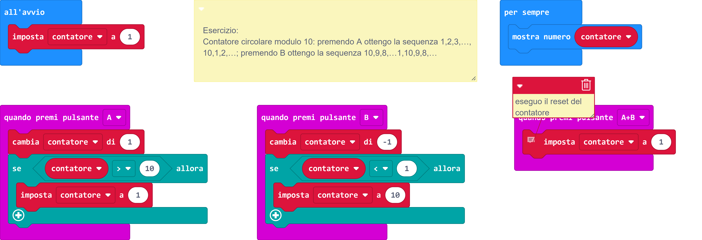

# Sorgente block



# Sorgente Python
```
"""

Esercizio:

Contatore circolare modulo 10: premendo A ottengo la sequenza 1,2,3,…, 10,1,2,…; premendo B ottengo la sequenza 10,9,8,…1,10,9,8,…

"""

def on_button_pressed_a():
    global contatore
    contatore += 1
    if contatore > 10:
        contatore = 1
input.on_button_pressed(Button.A, on_button_pressed_a)

def on_button_pressed_ab():
    global contatore
    # eseguo il reset del contatore
    contatore = 1
input.on_button_pressed(Button.AB, on_button_pressed_ab)

def on_button_pressed_b():
    global contatore
    contatore += -1
    if contatore < 1:
        contatore = 10
input.on_button_pressed(Button.B, on_button_pressed_b)

contatore = 0
contatore = 1

def on_forever():
    basic.show_number(contatore)
basic.forever(on_forever)

```
