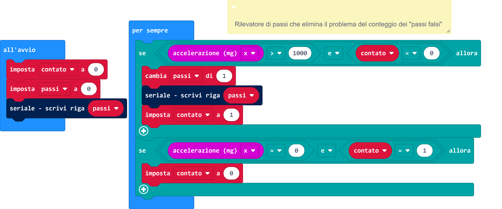

# Sorgente block



# Sorgente Python
```
contato = 0
passi = 0
serial.write_line("" + str((passi)))
"""

Rilevatore di passi che elimina il problema del conteggio dei "passi falsi"

"""

def on_forever():
    global passi, contato
    if input.acceleration(Dimension.X) > 1000 and contato == 0:
        passi += 1
        serial.write_line("" + str((passi)))
        contato = 1
    if input.acceleration(Dimension.X) == 0 and contato == 1:
        contato = 0
basic.forever(on_forever)

```
