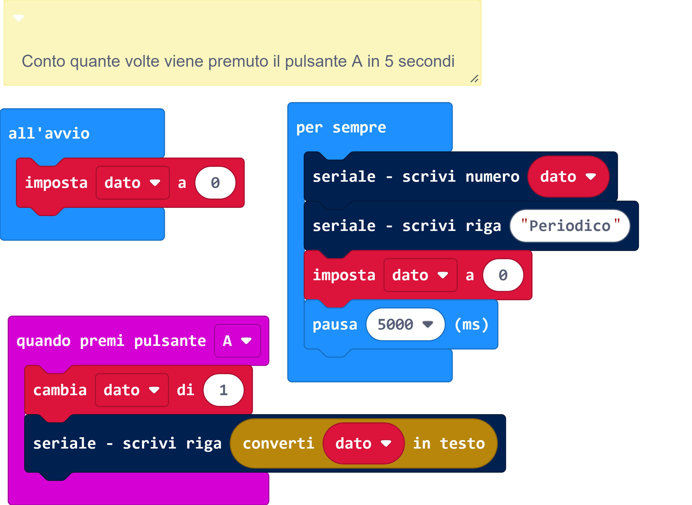

# Sorgente block



# Sorgente Python
```
def on_button_pressed_a():
    global dato
    dato += 1
    serial.write_line(convert_to_text(dato))
input.on_button_pressed(Button.A, on_button_pressed_a)

dato = 0
dato = 0
"""

Conto quante volte viene premuto il pulsante A in 5 secondi

"""

def on_forever():
    global dato
    serial.write_number(dato)
    serial.write_line("Periodico")
    dato = 0
    basic.pause(5000)
basic.forever(on_forever)

```
