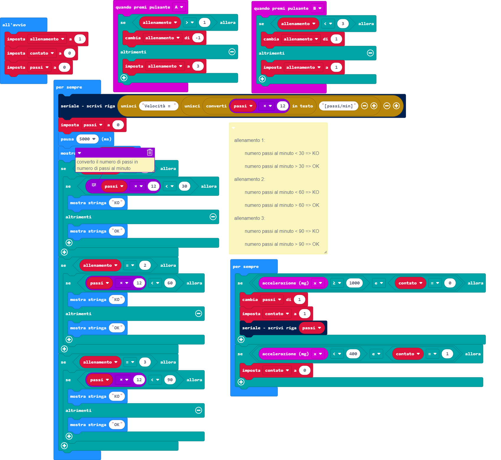

# Sorgente block



# Sorgente Python
```
def on_button_pressed_a():
    global allenamento
    if allenamento > 1:
        allenamento += -1
    else:
        allenamento = 3
input.on_button_pressed(Button.A, on_button_pressed_a)

def on_button_pressed_b():
    global allenamento
    if allenamento < 3:
        allenamento += 1
    else:
        allenamento = 1
input.on_button_pressed(Button.B, on_button_pressed_b)

allenamento = 0
allenamento = 1
contato = 0
passi = 0
"""

allenamento 1:

numero passi al minuto < 30 => KO

numero passi al minuto > 30 => OK

allenamento 2:

numero passi al minuto < 60 => KO

numero passi al minuto > 60 => OK

allenamento 3:

numero passi al minuto < 90 => KO

numero passi al minuto > 90 => OK

"""

def on_forever():
    global passi
    serial.write_line("Velocità = " + ("" + convert_to_text(passi * 12) + "[passi/min]"))
    passi = 0
    basic.pause(5000)
    basic.show_number(allenamento)
    if allenamento == 1:
        # converto il numero di passi in numero di passi al minuto
        if passi * 12 < 30:
            basic.show_string("KO")
        else:
            basic.show_string("OK")
    if allenamento == 2:
        if passi * 12 < 60:
            basic.show_string("KO")
        else:
            basic.show_string("OK")
    if allenamento == 3:
        if passi * 12 < 90:
            basic.show_string("KO")
        else:
            basic.show_string("OK")
basic.forever(on_forever)

def on_forever2():
    global passi, contato
    if input.acceleration(Dimension.X) >= 1000 and contato == 0:
        passi += 1
        contato = 1
        serial.write_line("" + str((passi)))
    if input.acceleration(Dimension.X) < 400 and contato == 1:
        contato = 0
basic.forever(on_forever2)

```
